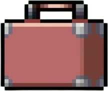

<p align="center">
  
</p>

<h1 align="center">CV-RADAR</h1>
<p align="center"><strong>ATS Resume Scanner & AI CV Optimizer</strong></p>

<p align="center">
  Score your CV against a Job Description. Find missing keywords. Auto-rewrite it for Workday, Taleo, Greenhouse, or iCIMS — headlessly, right inside your AI coding CLI.
</p>

<p align="center">
  <a href="https://github.com/bogusdeck/cv-radar/blob/main/LICENSE"></a>
  
  
  
  
</p>

---

## Quick Start — One Command

```bash
curl -fsSL https://raw.githubusercontent.com/bogusdeck/cv-radar/main/install.sh | bash
```

Or manually:

```bash
git clone https://github.com/bogusdeck/cv-radar.git
cd cv-radar
./install.sh
```

Then open your AI CLI inside the folder:

```bash
cd cv-radar
claude      # Claude Code
agy         # Antigravity
opencode    # OpenCode
codex       # Codex
```

And say:

```
/cv-optimizer
```

The agent reads the built-in skill and walks you through the full workflow.

---

## What It Does

| Feature | Description |
|---|---|
| **ATS Scoring Engine** | Scores your CV against a JD with platform-specific rules for Workday, Taleo, Greenhouse, and iCIMS |
| **Missing Keyword Detection** | Finds every required JD keyword that's missing from your CV |
| **TUI Dashboard** | Beautiful terminal UI to browse your score, grade, and recommendations |
| **AI Skill** | Auto-discovered by Claude Code, Codex, and Antigravity — just say `/cv-optimizer` |
| **Headless AI Optimization** | Dispatches `claude -p` / `agy -p` / `opencode run` in the background to rewrite your CV |
| **Web UI** | Full retro-styled web dashboard with live PDF compilation via Tectonic |

---

## Installation

### Prerequisites

| Tool | Required | Notes |
|---|---|---|
| `go` 1.21+ | ✅ Yes | [Download](https://go.dev/dl) |
| `git` | ✅ Yes | [Download](https://git-scm.com) |
| `tectonic` | For PDF compilation | [Install](https://tectonic-typesetting.github.io/book/latest/installation) |
| `node` 18+ | For web UI only | [Download](https://nodejs.org) |

### Install

```bash
# Option 1: One-liner (recommended)
curl -fsSL https://raw.githubusercontent.com/bogusdeck/cv-radar/main/install.sh | bash

# Option 2: Clone and install
git clone https://github.com/bogusdeck/cv-radar.git
cd cv-radar && ./install.sh
```

The installer will:
1. Clone the repo
2. Build the Go API server (`./server`)
3. Build the Go TUI dashboard (`./cv-tui`)
4. Build the React web UI (if Node is present)

---

## Usage

### 1. Inside your AI Coding CLI (Recommended)

Open the `cv-radar` folder in Claude Code, Antigravity, Codex, or OpenCode:

```bash
cd cv-radar
claude        # or: agy / opencode / codex
```

Then just say:

```
/cv-optimizer
```

The AI will:
- Ask for your CV and Job Description
- Score your CV against the JD
- Show missing keywords
- Rewrite your CV headlessly using the AI backend
- Output a compilable LaTeX file

---

### 2. TUI Dashboard

```bash
./cv-tui
```

- Arrow keys to select ATS platform
- See your score, grade, and missing keywords
- Press `O` to trigger headless AI optimization without leaving the TUI

---

### 3. Headless AI Optimization (CLI)

```bash
# Using Claude Code
./optimize.sh cv.tex jd.txt Workday claude

# Using Antigravity
./optimize.sh cv.tex jd.txt Workday agy

# Using OpenCode
./optimize.sh cv.tex jd.txt Workday opencode
```

The optimized LaTeX is saved to `optimized_cv.md`, ready to compile.

---

### 4. Web UI

```bash
./start.sh
```

Opens the full retro-styled web dashboard at `http://localhost:5173`:
- Upload your CV (PDF or LaTeX)
- Paste your Job Description
- Select ATS platform
- See your score, grade, matched and missing keywords
- Copy the AI mega-prompt and paste it into ChatGPT/Claude
- Paste back the LaTeX and compile it to PDF right in the browser

---

### 5. Go API (Direct)

```bash
./server   # starts on :8085

# Score a CV
curl -X POST http://localhost:8085/api/analyze \
  -F "jd=@jd.txt" \
  -F "platform=Workday"

# Compile LaTeX to PDF
curl -X POST http://localhost:8085/api/fix-resume/compile \
  -H "Content-Type: application/json" \
  -d '{"latex": "\\begin{document}...\\end{document}"}'
```

---

## ATS Platform Support

| Platform | Scoring Strategy |
|---|---|
| **Workday** | Strict exact-keyword matching. Penalizes missing required skills heavily. |
| **Taleo** | Keyword density scoring. Repeating JD keywords boosts score. |
| **Greenhouse** | Semantic AI + human review. Rewards natural phrasing and measurable impact. |
| **iCIMS** | Mixed exact + semantic. Title alignment matters most. |

---

## Project Structure

```
.agents/skills/cv-optimizer/   ← AI skill (auto-discovered by all CLI tools)
.claude/skills/cv-optimizer/   ← Claude Code specific
.codex-plugin/plugin.json      ← Codex plugin registration
cmd/server/                    ← Go API backend
cmd/tui/                       ← Go Bubbletea TUI dashboard
internal/ats/                  ← ATS scoring engines
internal/parser/               ← CV/PDF/LaTeX parser
internal/models/               ← Shared data models
web/                           ← React frontend (Vite + TypeScript)
optimize.sh                    ← Headless AI dispatch script
start.sh                       ← Full stack launcher
install.sh                     ← One-command installer
```

---

## Built With


---

## Author

Built by [Tanish Vashisth](https://github.com/bogusdeck)
